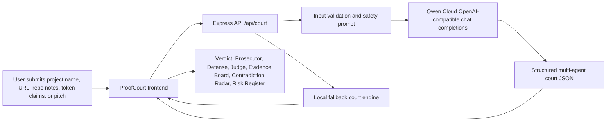

# Architecture

## Components

### Frontend

The frontend is a static court interface. It is intentionally not a chatbot. The goal is to make the agent workflow visually and conceptually clear:

- Case Intake
- Judge's Verdict
- Prosecutor Agent
- Defense Agent
- Judge Agent
- Evidence Board
- Contradiction Radar
- Risk Register

### Backend

The backend is a small Express service:

- validates input with Zod
- calls Qwen Cloud via the OpenAI-compatible API
- asks for strict JSON output
- normalizes missing fields
- returns a fallback result when no API key is configured

### Qwen Cloud Prompting

The system prompt asks Qwen to behave as ProofCourt for Solana and return structured JSON with:

- verdict
- case theory
- prosecutor thesis and arguments
- defense thesis and arguments
- judge ruling and next actions
- evidence labels
- contradictions
- risk register
- investor memo

## Deployment Target

The intended hackathon deployment is Alibaba Cloud:

- ECS or Simple Application Server for Node/Express
- environment variables for Qwen API access
- Nginx or platform routing to expose port 3000

See [../deployment/ALIBABA_CLOUD.md](../deployment/ALIBABA_CLOUD.md).
