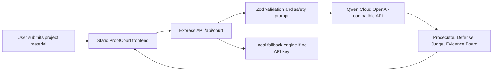

# Devpost Submission Package

Use this file as the copy/paste source for the Qwen Cloud AI Agent Hackathon submission.

## Submission Status

Ready:

- Public GitHub repo with MIT license: https://github.com/lvupupui/proofcourt-for-solana
- Live demo: https://proofcourt-for-solana.vercel.app
- Qwen Cloud API integration is live: `/api/health` reports `qwenConfigured: true`
- Architecture diagram source: https://github.com/lvupupui/proofcourt-for-solana/blob/main/docs/ARCHITECTURE.md
- Alibaba/Qwen usage proof in code: https://github.com/lvupupui/proofcourt-for-solana/blob/main/src/server.js

Still needed before final submission:

- Record and upload a public demo video under 3 minutes.
- If the submission form strictly requires backend deployment on Alibaba Cloud, add Alibaba Cloud ECS, Simple Application Server, or Function Compute proof. The current public demo is deployed on Vercel while using Alibaba Cloud Model Studio/Qwen API.

## Track

Track 3: Agent Society

Reason: ProofCourt uses multiple role-based agents that argue, defend, judge, label evidence, and produce a coordinated verdict.

## Project Name

ProofCourt for Solana

## Tagline

A Qwen Cloud powered evidence court that cross-examines Solana projects before founders, investors, and grant reviewers trust their claims.

## Project URLs

- Live demo: https://proofcourt-for-solana.vercel.app
- Code repository: https://github.com/lvupupui/proofcourt-for-solana
- Architecture diagram: https://github.com/lvupupui/proofcourt-for-solana/blob/main/docs/ARCHITECTURE.md
- Alibaba/Qwen proof code: https://github.com/lvupupui/proofcourt-for-solana/blob/main/src/server.js
- Deployment notes: https://github.com/lvupupui/proofcourt-for-solana/blob/main/deployment/ALIBABA_CLOUD.md

## Short Description

ProofCourt for Solana turns a startup pitch, project URL notes, or repo summary into a structured AI court session. A Prosecutor Agent challenges weak claims, a Defense Agent finds the strongest reasonable case, and a Judge Agent returns a verdict with evidence labels, contradictions, risk scores, and next actions. The system is powered by Qwen Cloud through Alibaba Cloud Model Studio's OpenAI-compatible API.

## Long Description

Crypto and AI startup pitches often sound convincing before the evidence is checked. ProofCourt for Solana is built for that uncomfortable middle step: deciding whether a project deserves more time, diligence, partnership, grant review, or investor attention.

Instead of producing a generic summary, ProofCourt stages an adversarial review. The user enters a Solana project name and supporting material. The backend sends the case packet to Qwen Cloud and asks for strict JSON across several roles:

- Prosecutor Agent: challenges unsupported or overreaching claims.
- Defense Agent: identifies the strongest fair interpretation of the evidence.
- Judge Agent: issues a verdict and next actions.
- Evidence Board: labels claims as observed, inferred, unverified, contradicted, or not found.
- Contradiction Radar: exposes gaps between pitch language and public proof.
- Risk Register: scores major diligence risks.
- Investor Memo: surfaces why-now, wedge, moat, and killer-question prompts.

The result is a practical decision surface, not a chatbot transcript. It is designed for founders, grant reviewers, ecosystem leads, and early investors who need sharper judgment before spending serious time on a project.

## Inspiration

Most AI diligence tools produce polished reports too quickly. In crypto, that can be risky because public materials often mix real evidence, token incentives, optimistic claims, and missing proof. ProofCourt was inspired by the idea that an AI agent should not only summarize a project. It should put the claims on trial.

## What It Does

ProofCourt accepts a project name, evidence packet, and mode such as investor, grant, partner, or quick review. It returns a structured court result with:

- verdict
- case theory
- prosecutor arguments
- defense arguments
- judge ruling
- evidence labels
- contradictions
- risk register
- investor memo

## How We Built It

The app uses a Node.js Express backend and a static HTML/CSS/JavaScript frontend. The backend validates input, calls Qwen Cloud through an OpenAI-compatible chat completions endpoint, requests strict JSON, normalizes missing fields, and returns the result to the UI.

The frontend is intentionally designed as a court interface instead of a chat interface. This makes the multi-agent reasoning visible and memorable in a demo while keeping the output useful for real decisions.

The project also includes a local fallback engine so reviewers can inspect the interface without secrets. In production, the deployed app uses environment variables for the Qwen API key, model, and Alibaba Cloud Model Studio workspace endpoint.

## Use Of Qwen Cloud / Alibaba Cloud

ProofCourt uses Qwen Cloud as the reasoning engine for the court session. The deployed backend calls Alibaba Cloud Model Studio through the OpenAI-compatible endpoint:

```text
POST /chat/completions
```

The model receives a structured case packet and returns JSON for the Prosecutor, Defense, Judge, Evidence Board, Contradiction Radar, Risk Register, and Investor Memo. The live deployment has been tested and returns:

```text
engine: qwen-cloud
model: qwen-plus
```

Proof in repository:

- API implementation: https://github.com/lvupupui/proofcourt-for-solana/blob/main/src/server.js
- Deployment configuration notes: https://github.com/lvupupui/proofcourt-for-solana/blob/main/deployment/ALIBABA_CLOUD.md

## Architecture Diagram

Use this file as the architecture diagram attachment or link:

https://github.com/lvupupui/proofcourt-for-solana/blob/main/docs/ARCHITECTURE.md

Summary:



## Testing Instructions

1. Open https://proofcourt-for-solana.vercel.app
2. Keep mode as `Investor`.
3. Use this sample material:

```text
HelioVault is a Solana treasury automation product. It claims to help DAOs rebalance stablecoin reserves, detect suspicious governance proposals, and generate risk memos from on-chain activity. The team says it has three pilot DAOs, a working dashboard, and Qwen-powered risk analysis, but no audit has been completed yet.
```

4. Click `Run Court Session`.
5. Confirm the result shows a verdict, prosecutor argument, defense argument, judge ruling, evidence board, contradiction radar, risk register, and investor memo.

## Demo Video Script Under 3 Minutes

0:00-0:15
Introduce the problem:

> Solana projects move fast, but diligence is slow. ProofCourt turns a pitch or project evidence packet into a structured AI court session powered by Qwen Cloud.

0:15-0:35
Show the UI:

> This is not a chatbot. The interface is a court: intake, verdict, prosecutor, defense, judge, evidence board, contradiction radar, and risk register.

0:35-1:15
Run a live case:

> I will paste a Solana project pitch. Qwen Cloud now cross-examines the claims and returns strict JSON for multiple agent roles.

1:15-2:05
Walk through output:

> The prosecutor challenges unsupported claims. The defense gives the strongest fair interpretation. The judge issues a verdict. The evidence board separates observed facts from unverified claims. The risk register turns uncertainty into next actions.

2:05-2:35
Explain Qwen/Alibaba usage:

> The backend is a Node/Express API that calls Qwen Cloud through Alibaba Cloud Model Studio's OpenAI-compatible endpoint. The deployed app reports `qwenConfigured: true`, and generated results are marked `engine: qwen-cloud`.

2:35-2:55
Close:

> ProofCourt helps founders, grant reviewers, ecosystem leads, and investors decide what deserves deeper diligence before they spend serious time on it.

## Video Recording Checklist

- Keep the video under 3 minutes.
- Show the public URL in the browser.
- Show a fresh case submission.
- Show the result after Qwen returns.
- Show `/api/health` or mention that it reports `qwenConfigured: true`.
- Do not use copyrighted music.
- Upload publicly to YouTube, Vimeo, or Youku.

## Screenshots To Capture

- Home page at https://proofcourt-for-solana.vercel.app
- A completed court session result.
- `/api/health` response showing `qwenConfigured: true`.
- GitHub repository README showing live demo and MIT license.
- Alibaba Cloud Model Studio page showing Qwen workspace/API setup, with the API key redacted.

## Final Devpost Field Checklist

- Project name: ProofCourt for Solana
- Track: Agent Society
- Elevator pitch/tagline: use the tagline above.
- Project description: use Short Description or Long Description above.
- Built with: Qwen Cloud, Alibaba Cloud Model Studio, Node.js, Express, JavaScript, Vercel
- Try it out URL: https://proofcourt-for-solana.vercel.app
- Code URL: https://github.com/lvupupui/proofcourt-for-solana
- Video URL: add after recording/uploading.
- Architecture diagram URL: https://github.com/lvupupui/proofcourt-for-solana/blob/main/docs/ARCHITECTURE.md
- Alibaba/Qwen proof URL: https://github.com/lvupupui/proofcourt-for-solana/blob/main/src/server.js
